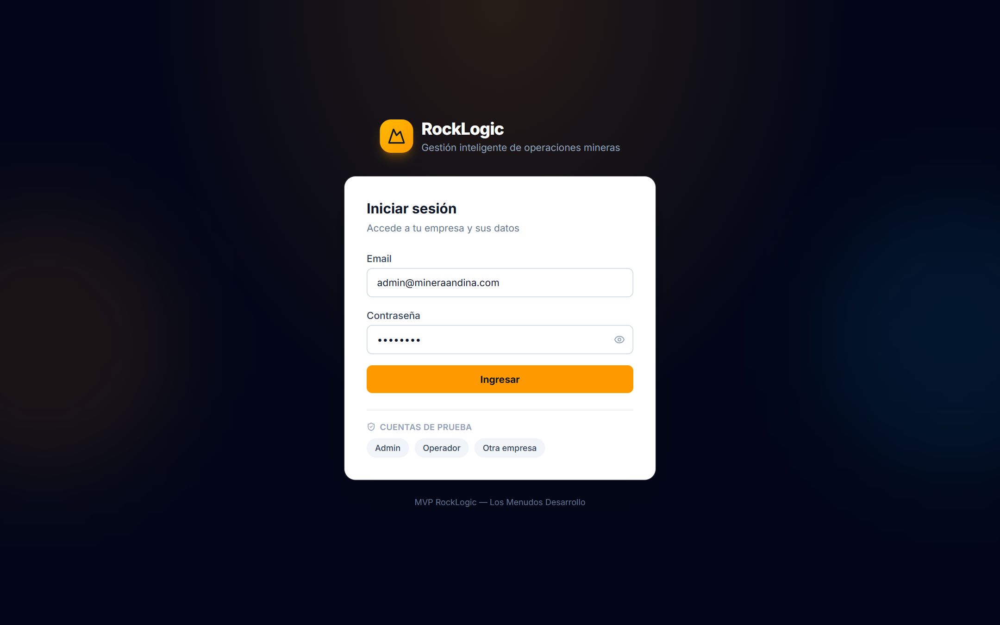
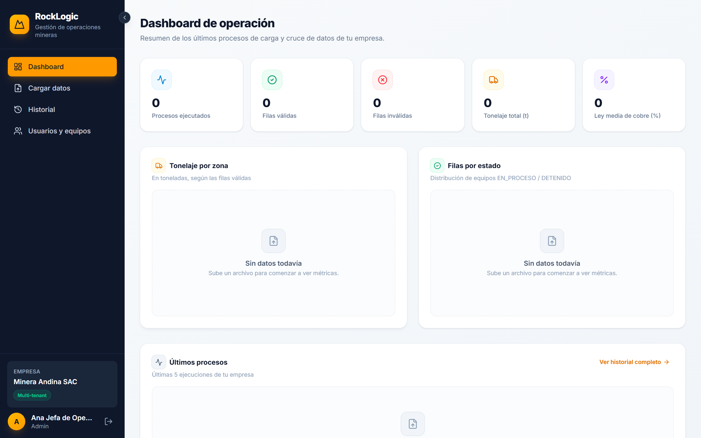
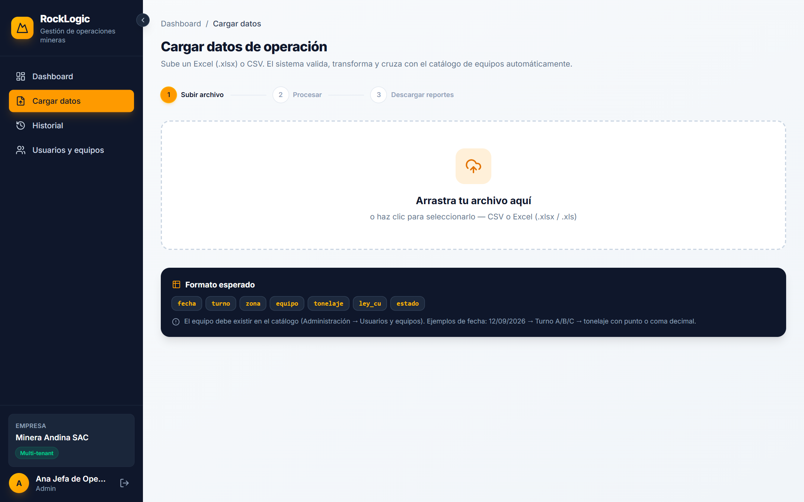
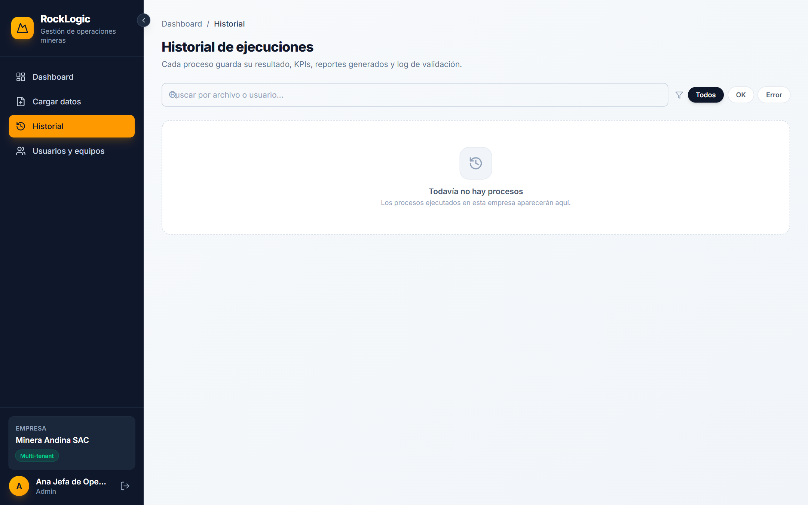
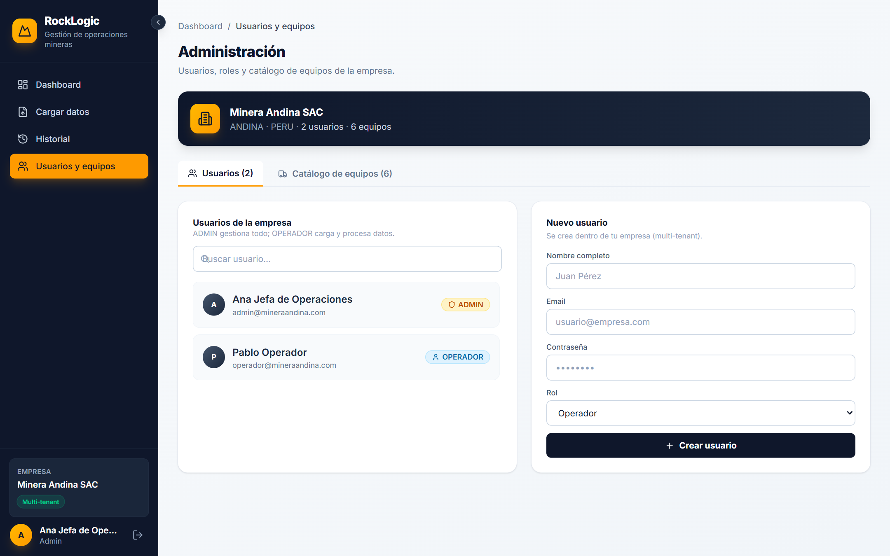

<p align="center">
  
</p>

<h1 align="center">🗻 RockLogic</h1>

<p align="center">
  <b>Gestión inteligente de operaciones mineras</b><br/>
  Plataforma para cargar datos de mina, validarlos, cruzarlos contra el catálogo de equipos y generar reportes profesionales — desde el navegador o desde el escritorio.
</p>

<p align="center">
  
  
  
  
  
  
</p>

---

## ✨ ¿Qué es RockLogic?

**RockLogic** es un MVP de gestión de operaciones mineras con tres frentes conectados a un mismo corazón:

| Interfaz | Tecnología | Descripción |
|---|---|---|
| 🌐 **Web** | React + Vite + Tailwind | Dashboard con KPIs, carga de archivos, historial y gestión de usuarios |
| 🖥️ **Escritorio** | JavaFX 25 | Cliente nativo de Windows con la misma experiencia y conexión a la misma API |
| ⚙️ **API** | Spring Boot | Motor de validación, cruce de catálogo, reportes y administración |

Cada empresa minera ve **solo sus propios datos** (multitenant) y cada usuario trabaja con roles y permisos definidos.

---

## 🚀 Funcionalidades

- 📤 **Carga de datos** desde Excel (`.xlsx`), `.xls` o CSV con validación campo a campo.
- ✅ **Validación y transformación**: fechas, turnos, rangos de tonelaje y ley de cobre.
- 🔗 **Cruce contra catálogo**: los equipos que no existen en el inventario se marcan automáticamente.
- 📊 **KPIs por zona y estado**: tonelaje total, ley promedio, gráficos de barras y dona.
- 📄 **Reportes profesionales** en Excel y PDF descargables.
- 🕘 **Historial completo** con log de cada corrida y cada fila procesada.
- 📧 **Notificaciones por email** opcionales con el resumen del proceso.
- 👥 **Multi-usuario y multi-tenant** con roles ADMIN / OPERATOR.
- 🎨 **Diseño corporativo rediseñado**: branding RockLogic, paleta slate/ámbar y tipografía Inter.

---

## 📸 Capturas del producto

| Acceso seguro | Tablero ejecutivo |
|---|---|
|  |  |

| Carga y procesamiento | Historial y trazabilidad |
|---|---|
|  |  |

| Administración |
|---|
|  |

> Todas las capturas corresponden a la app corriendo contra datos reales del MVP.

---

## 🗂️ Estructura del proyecto

```
RockLogic/
├── backend/            # API REST Spring Boot (puerto 8080)
├── frontend/           # Aplicación web React + Vite + Tailwind (puerto 5173)
├── desktop/            # Cliente de escritorio JavaFX (mismo modelo de la API)
├── scripts/            # Lanzadores run-backend / run-frontend / run-desktop
├── presentation/       # Material comercial y diagramas
│   ├── RockLogic-presentacion-comercial.pptx   # Deck comercial de 16 slides
│   ├── assets/                                 # Capturas reales del producto
│   └── diagrams/
│       ├── recorrido-sistema.drawio            # Diagrama editable (draw.io)
│       ├── recorrido-sistema.png               # Exportación a imagen
│       └── recorrido-sistema.vsdx              # Exportación compatible con Visio
└── assets/             # Recursos del README
```

---

## ▶️ Arranque rápido

> Requisitos: JDK 25 (Temurin/Adoptium), Node.js 20+, Maven 3.9.

### 1. Backend — API en `:8080`
```batch
scripts\run-backend.bat
```

### 2. Frontend — Web en `:5173`
```batch
scripts\run-frontend.bat
```
Abrir [http://localhost:5173](http://localhost:5173)

### 3. Escritorio
```batch
scripts\run-desktop.bat
```

### Sin scripts (modo desarrollador)
```bash
# API (desde backend/)
mvn spring-boot:run

# Web (desde frontend/)
npm install && npm run dev

# Escritorio (desde desktop/)
mvn javafx:run
```

> Los `.bat` usan `ping -n 4 127.0.0.1 >nul` en lugar de `timeout` para evitar errores de redirección en consolas con encoding por defecto.

---

## 🔐 Credenciales de demostración

| Empresa | Rol | Correo | Contraseña |
|---|---|---|---|
| Minera Andina | Administrador | `admin@mineraandina.com` | `admin123` |
| Minera Andina | Operador | `operador@mineraandina.com` | `oper123` |
| Minera del Sur | Administrador | `admin@minadelsur.com` | `admin123` |

---

## 🛡️ Seguridad

- Autenticación con token **JWT** (validez de 24 h) en todos los endpoints.
- Roles **ADMIN** y **OPERATOR** con capacidades diferenciadas.
- **Aislamiento por empresa**: cada tenant accede únicamente a sus datos.
- Trazabilidad: toda corrida de procesamiento queda registrada con estado y log.

---

## 👨‍💻 Configuración de IDE (IntelliJ)

1. Abrir `desktop/` como proyecto Maven.
2. Registrar el JDK 25 del sistema: `Project Structure → SDKs → Add JDK`
   (ruta típica: `C:\Program Files\Eclipse Adoptium\jdk-25.0.4.101-hotspot`).
3. El proyecto ya declara Java 25, JavaFX 25.0.2 y Jackson 2.17.2 en `desktop/pom.xml`.

Los diagramas se editan con **draw.io** (gratuito) y el recorrido del sistema también está exportado en formato **`.vsdx`** para importar en Microsoft Visio.

---

## ✍️ Material comercial

Dentro de `presentation/` está el deck **RockLogic-presentacion-comercial.pptx** (16 slides, orientado a negocio) construido con las capturas reales del producto y el diagrama de recorrido del sistema. Para regenerarlo:

```bash
python presentation/build_pptx.py   # requiere python-pptx
```

---

## 🧰 Stack

| Capa | Tecnología |
|---|---|
| Backend | Spring Boot 3.5, Spring Security, JWT, H2 (archivo), Jakarta Mail |
| Frontend | React 19, Vite 6, Tailwind 4, Recharts |
| Escritorio | JavaFX 25, Jackson |
| Diagramas | draw.io (+ exportación .vsdx para Visio) |
| Presentación | python-pptx |

---

## 📄 Licencia

Proyecto de demostración (MVP). Datos de ejemplo en `backend/sample-data/`.